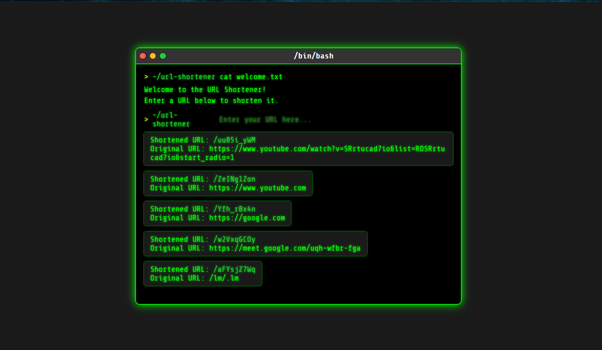

# Simple URL Shortener

A minimalist, terminal-themed URL shortener application built with Node.js, Express, and Supabase. This application allows users to shorten long URLs into a more manageable format and view a list of previously shortened URLs.




## Features

- **Shorten URLs:** Convert long URLs into a unique, short ID.
- **URL Redirection:** Access the original URL by visiting the shortened link.
- **Dynamic UI:** A terminal-themed interface that updates in real-time.
- **URL History:** View a list of all previously shortened URLs.
- **Backend Powered by Express:** A robust and efficient Node.js backend.
- **Database by Supabase:** Uses a Supabase PostgreSQL database for persistent URL storage.

## Getting Started

These instructions will get you a copy of the project up and running on your local machine for development and testing purposes.

### Prerequisites

- [Node.js](https://nodejs.org/) (v14 or later)
- [npm](https://www.npmjs.com/) (usually comes with Node.js)
- A [Supabase](https://supabase.com/) account and project.

### Installation

1.  **Clone the repository:**
    ```sh
    git clone <your-repository-url>
    cd <your-repository-name>
    ```

2.  **Install dependencies:**
    ```sh
    npm install
    ```

3.  **Set up your environment variables:**

    - Create a `.env` file in the root of the project.
    - Add your Supabase project's URL and anon key to the `.env` file:

      ```env
      SUPABASE_URL=your_supabase_project_url
      SUPABASE_ANON_KEY=your_supabase_anon_key
      ```

    - You will also need a `urls` table in your Supabase database with the following columns:
      - `id` (int8, primary key)
      - `created_at` (timestamptz, default: `now()`)
      - `URL` (text)
      - `ShortenedUrl` (text)

## Usage

1.  **Run the application in development mode:**
    (This will use `nodemon` to automatically restart the server on file changes)
    ```sh
    npm run dev
    ```

2.  **Run the application in production mode:**
    ```sh
    npm start
    ```

3.  Open your browser and navigate to `http://localhost:3000`.

## Project Structure

```
.
├── public/
│   └── index.html      # Main HTML file with the UI
├── .env.example        # Example environment file
├── .gitignore
├── package.json
├── README.md
├── server.js           # Express server logic
└── supabaseClient.js   # Supabase client configuration
```
